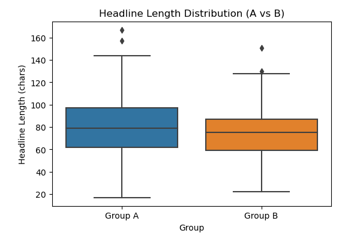
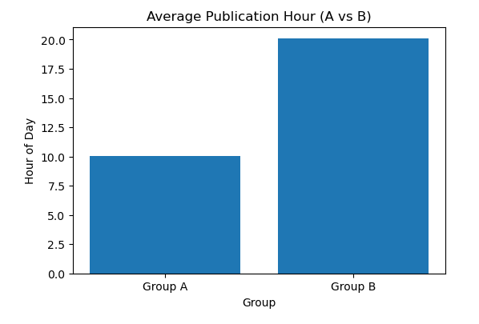
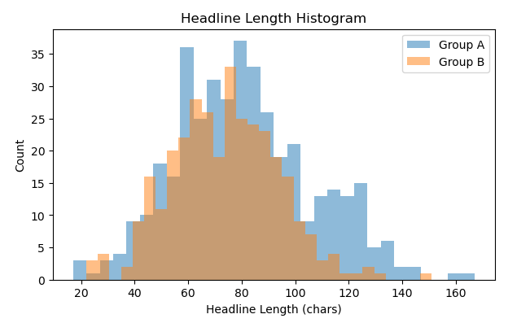

# News-Headline-AB-Testing

## Which Headline Works Better? A/B Testing with Real API Data
_A data analytics project that leverages real-world news data to simulate an A/B experiment, evaluate publication timing strategies, and apply statistical hypothesis testing to uncover meaningful differences in headline characteristics._

## Project Overview
Data-driven experimentation has become an essential part of modern digital publishing. News organizations continuously evaluate publishing strategies to understand what type of content resonates with readers and how publication timing influences audience behavior.

This project simulates an A/B experiment using real-world news articles collected through the NewsAPI. Rather than relying on synthetic datasets, the analysis uses live article metadata to compare headlines published during morning hours against those published during the evening.

The project follows a complete analytics workflow from API integration and data acquisition to statistical testing and business interpretation demonstrating practical skills in data wrangling, exploratory analysis, hypothesis testing, and data storytelling.

## Business Problem
Digital publishers compete for reader attention in an increasingly crowded information landscape. Every day, editors make decisions regarding when content should be published, how headlines should be written, and which publishing strategies maximize audience engagement.

One common assumption is that articles published during different times of the day are crafted differently to align with reader behavior. Morning publications may emphasize detailed and informative headlines, while evening publications may prioritize concise headlines for faster consumption. Understanding these differences allows media organizations to:
* Improve editorial planning.
* Optimize publishing schedules.
* Develop evidence-based headline strategies.
* Support data-informed content decisions rather than relying solely on intuition.

This project investigates one aspect of that problem by examining whether publication timing is associated with significant differences in headline length.

## Project Objectives
The primary objectives of this project were to:
* Collect real-world news article data through the NewsAPI.
* Simulate an A/B testing experiment using publication time as the grouping variable.
* Engineer new features required for statistical analysis.
* Clean and preprocess the collected dataset.
* Perform exploratory data analysis to understand publication patterns.
* Detect and remove statistical outliers.
* Conduct hypothesis testing using Welch's Independent Two-Sample t-test.
* Interpret statistical findings within a business context.
* Provide recommendations for future experimentation and editorial decision-making.

## Methodology
1. Data Collection
The dataset was collected directly from NewsAPI, a REST API providing access to articles from hundreds of international news publishers. The following search terms were selected to ensure diversity in article topics while maintaining relevance across major news domains.
* Technology
* Business
* Health

### Collection Period
* Start Date: May 13, 2025
* End Date: June 13, 2025
* Total Records Retrieved - 1,200 Articles

2. Feature Engineering - Raw API responses were transformed into analytical features required for experimentation. Three new variables were engineered:
* Headline Length: Calculated as the number of characters in each article headline.
* Publication Hour: Extracted from the publication timestamp.
* Experimental Group: Assigned based on publication time.
These engineered variables formed the foundation for the A/B testing analysis.

3. A/B Test Design

To simulate an experimental setting, articles were divided into two independent groups based on publication time.

| Group | Publishing Window | Articles | Share |
|---|---|---|---|
| **Group A** - Morning | 6AM - 12PM | 401 | 54.9% |
| **Group B** - Evening | 6PM - 12AM | 329 | 45.1% |

Articles published outside these windows were intentionally excluded to maintain clearly defined comparison groups and reduce overlap between experimental conditions. This design enables the investigation of whether editorial practices differ between morning and evening publication periods.

4. Data Cleaning & Preprocessing

Before statistical analysis, the dataset underwent several preprocessing steps to improve data quality. These included:

| Issue | Action Taken |
|---|---|
| `sourceId` - 686 missing | Dropped (not needed for analysis) |
| `author` - 152 missing | Filled with `'Unknown'` |
| `description` - 30 missing | Filled with `'None'` |
| `urlToImage` - 37 missing | Dropped (not relevant) |
| `group` - null (outside windows) | Rows removed |
| **Final clean dataset** | **730 articles** |

5.Sample Size Validation
Using `TTestIndPower` from `statsmodels`, the minimum required sample per group was calculated at **64 articles**. Both groups comfortably exceeded this threshold, ensuring a reliable test.

6. Statistical Test
Applied **Welch's t-test** (chosen for unequal group sizes) to compare mean headline lengths between Group A and Group B.

## 📈 Results
### Headline Length Summary

| Metric | Group A (Morning) | Group B (Evening) |
|---|---|---|
| Mean Length | **80.6 characters** | 73.8 characters |
| Median Length | 79.0 characters | 75.0 characters |
| Sample Size | 401 | 329 |

### Welch's T-Test Output

| Metric | Value |
|---|---|
| T-statistic | **3.9575** |
| P-value | **0.0001** |
| Result | ✅ Reject H₀ — statistically significant |

**Interpretation:** With p = 0.0001, far below our threshold of 0.05, the null hypothesis was rejected. This indicates that the observed difference in average headline length between morning and evening publications is statistically significant.

## 🖼️ Visualisations

### Headline Length Distribution by Group

> Group A (Morning) shows a higher median and mean headline length compared to Group B (Evening), with some overlap in the interquartile range.

### Average Publication Hour by Group

> Group A articles cluster around 10AM on average, while Group B articles average around 8PM — confirming clean separation between the two test windows.

### Headline Length Histogram — Group A vs Group B

> Both distributions are roughly normal. Group A's distribution is shifted right, indicating consistently longer headlines across the morning publishing window.

## 💡 Business Recommendations

**1. Lean into morning publishing for detailed, informative headlines**
Morning articles averaged 9% longer headlines. This likely reflects structured editorial planning, recapping overnight news with more deliberate headline writing. Platforms optimising for SEO and depth should prioritise morning slots.

**2. Standardise evening headline strategy**
Evening articles showed higher variation in both headline length and source distribution. A style guide for evening publishing could bring consistency and improve audience expectations.

**3. Move from proxy to direct engagement testing**
Headline length was used as a proxy for engagement in this analysis. The logical next step is to run A/B tests on actual click-through rates or read-time data to establish direct causal impact.

**4. Acknowledge data limitations**
- NewsAPI free tier truncates article content, word counts may not reflect full articles
- No direct engagement metrics (clicks, shares) were available
- Articles outside the 6AM–12PM and 6PM–12AM windows were excluded, removing 39% of the dataset

## 🛠️ Tools & Libraries

| Tool | Purpose |
|---|---|
| `newsapi-python` / `requests` | Live API data extraction |
| `pandas` | Data cleaning, filtering, group analysis |
| `numpy` | Numerical operations |
| `scipy.stats` | Welch's t-test |
| `statsmodels` | Sample size power analysis |
| `matplotlib` / `seaborn` | Visualisation |
